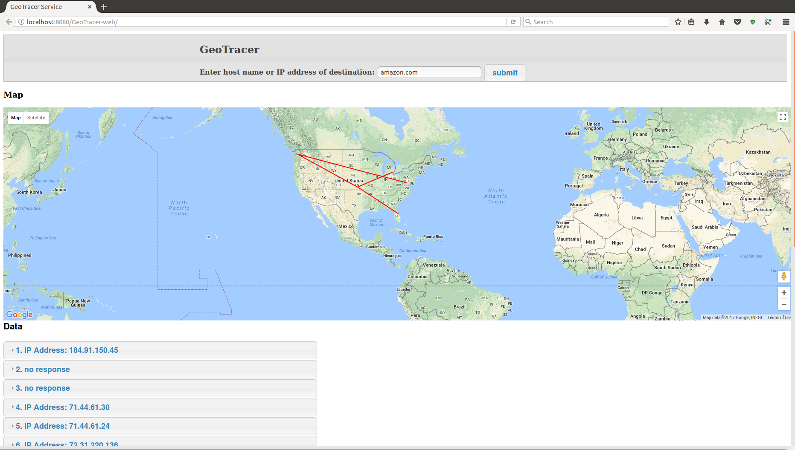
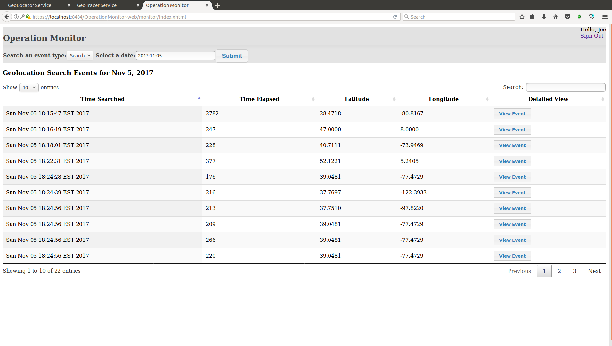
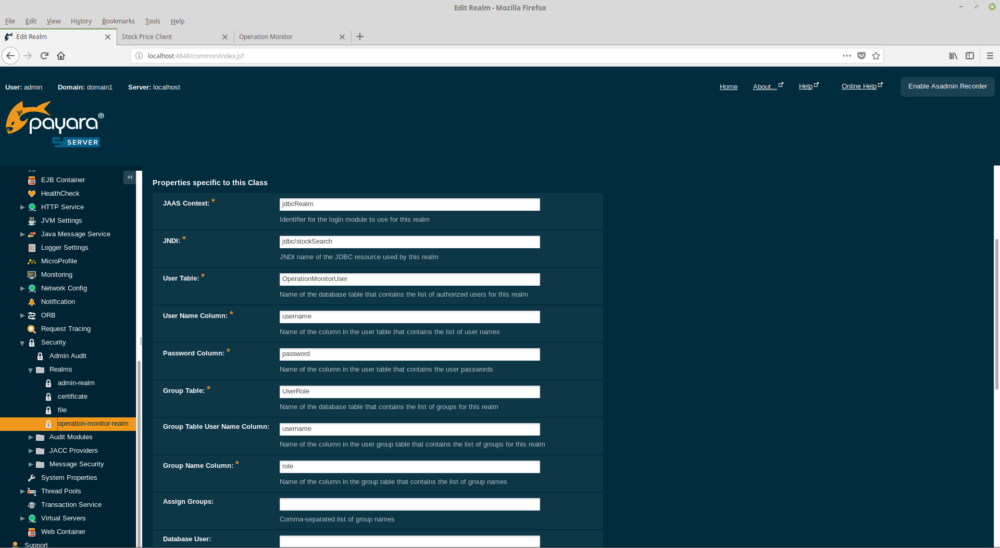

# operation-monitor

## System Overview

This set of enterprise applications provides example usages of web services and message queues. The Geolocator application is a web service which provides geographic location data using IP address input in web service calls to publicly available web services.  The Geotracer application, similar to the Geolocator, is a web service providing geographic data using publicly available web services.  The Geotracer, moreover, displays data for a trace route when given a destination URL. Both the Geolocator and Geotracer relay these web service events to a message queue monitored by the Operation Monitor application.

<figure>
  
  <figcaption>Figure1. GeoLocator</figcaption>
</figure> 
 
<figure>
  
  <figcaption>Figure 2. GeoTracer</figcaption>
</figure> 
 
<figure>
  
  <figcaption>Figure 3. Operation Monitor</figcaption>
</figure> 
 

## Purpose

The purpose of this repository is to provide example implementations of various technologies in Java.  The source code may also be a reference for JQuery and MySQL statements as these languages were also used in the development of these applications.  Some of the technologies used in the source code are listed below.

	a) Java Server Faces (JSF)
	b) Enterprise Java Beans (EJB)
	c) Java Persistence API (JPA)
	d) Java API for RESTful Web Services (JAX-RS)
	e) Java Message Service (JMS)
	f) Java EE Security
	g) Concurrency Utilities for Java EE
	h) jBCrypt

## Setup and Run Instructions

### Contents

	Section A - requirements

	Section B - build MySQL database

	Section C - configuration

	Section D - build application

	Section E - deploy application

	Section F - notes

### Section A - requirements

**a)** Download and install MySQL Community Server 5.7 and Workbench from 

http://dev.mysql.com/downloads/

**b)** Download and install JDK 8 from 

http://www.oracle.com/technetwork/java/javase/downloads/index.html

**c)** Download and install NetBeans 8 IDE with GlassFish Server from

https://netbeans.org/downloads/

### Section B - build MySQL database

**a)** In Workbench, open and execute the file named "geolocations_db.sql".

### Section C - configuration

**a)** Java Message Service

 - These applications require a message queue to be established. To create the required message queue, follow the steps below.

		- In the Services view of NetBeans, expand the Servers node, right-click the GlassFish Server, and select "Start".

		- Once the Server has started, navigate to http://localhost:4848/ to open the GlassFish Console.

		- In GlassFish Admin Console, expand "Resources" and select "Connection Factories" under "JMS Resources". Add a new ConnectionFactory resource named "OperationQueueConnectionFactory".

		- Under "JMS Resources", select "Destination Resources" and add a new Queue resource named "OperationQueue".

**b)** JDBC Configuration

 - To configure the database connectivity for the application, remain in the GlassFish Console to perform the next steps.

		- Expand the "Resources" node in the Common Tasks menu and select "JDBC Connection Pools" within the "JDBC" menu option.
		 
		- Click "New..." to create a new connection pool.
		 
		- In the "New JDBC Connection Pool" page, enter "MySQLConnPool" for the new pool name, "javax.sql.DataSource" as the resource type, and "MySql" as the database driver vendor.  Click "Next".
		 
		- Accept all default values by clicking "Finish".
		 
		- Select the newly created connection pool from the JDBC Connection Pools page.
		 
		- Select the "Additional Properties" tab and add the following properties.
		 
	| Name  | Value |
	| ------ | ----- |
	| serverName  | localhost |
	| portNumber  | 3306  |
	| databaseName  | geolocations  |
	| user  | geolocations_db_user  |
	| password  | 9vW00q24CTy@(zl}  |
		
		- Click on "Save" to save the new properties
		
		- In the "General" tab for this datasource, click on "Ping" to test the connection.
		
		- If the connection test is successful, proceed to "JDBC Resources" within the "JDBC" menu.
		
		- Click "New..." to create a new JDBC resource.
		
		- Enter "jdbc/geolocations" for the JNDI Name and select "MySQLConnPool" for the Pool Name.
		
		- Click "OK" to save the new resource.

**c)** Java EE Security

 - A JDBC security realm must be established to enable container-managed security. Follow the steps below to create the security realm.

		- Expand the nodes, "Configurations", "server-config", "Security", "Realms".

		- Click "New..." to create a new realm.

		- Enter "operation-monitor-realm" for Realm Name and select "com.sun.enterprise.security.auth.realm.jdbc.JDBCRealm" for Class Name.

		- Enter the following properties

	| Name  | Value |
	| ------ | ----- |
	| JAAS Context  | jdbcRealm |
	| JNDI  | jdbc/geolocations  |
	| User Table  | GeolocationsUser  |
	| User Name Column  | username  |
	| Password Column  | password  |
	| Group Table  | UserRole |
	| Group Table User Name Column  | username  |
	| Group Table Column  | role  |
	| Password Encryption Algorithm  | none  |
	| Digest Algorithm  | none  |
	| Charset  | UTF-8  |

		- Click "OK" to save this realm. The properties of this realm are displayed in the following figure.

<figure>
  
  <figcaption>Figure 4. JDBC Realm</figcaption>
</figure> 
 
	
 - After this procedure, exit GlassFish Console and shut down the server in NetBeans.

### Section D - build application

These applications are built with Maven, so all JAR dependecies are specified in the projects' pom.xml files. Each application can be built from NetBeans IDe by right-clicking the top-level project node and selecting "Clean and Build".

### Section E - deploy application

**a)** These applications can be run on the GlassFish Server from within the NetBeans IDE by  right-clicking the EAR project node and selecting "Run".

**b)** View the Operation Monitor application by pointing the web browser to https://localhost:8181/OperationMonitor-web for a connection with SSL/TLS implemented.  Otherwise, comment out the web module security constraint in /WEB-INF/web.xml and point the browser to http://localhost:8080/OperationMonitor-web. The applications, GeoLocator and GeoTracer, do not have this security constraint.
	

### Section F - notes

**a)** For the Operation Monitor, default users are provided in the database with the following credentials:

| username  | password | role |
| --------- | -------- | ---- |
| admin1  | adminpass | administrator |
| user1  | userpass  | user |

**b)** SSL/TLS:

 - To utilize SSL/TLS on localhost, a self-signed certificate is required.  With a self-signed certificate created, access the running application by SSL/TLS by pointing a web browser to https://localhost:8181/{AppName}.

 - Otherwise, comment out the application's security constraint in /WEB-INF/web.xml of OperationMonitor-web and access the running application by pointing a web browser to http://localhost:8080/{AppName}.

